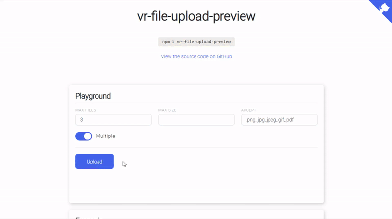

<p align="center"><a href="https://vreactor.github.io/vr-file-upload-preview/" target="_blank"></a></p>

# vr-file-upload-preview

<p align="left">
    <a href="https://www.npmjs.com/package/vr-file-upload-preview"></a>
    <a href='https://travis-ci.com/VReactor/vr-file-upload-preview.svg?branch=master'></a>
    <a href='https://coveralls.io/github/VReactor/vr-file-upload-preview?branch=master'></a>
    <a href="https://www.npmjs.com/package/vr-file-upload-preview"></a>
    <a href="http://opensource.org/licenses/MIT"></a>
</p>

This is a custom element (web component - can be used every where regardless the framework).

`vr-file-upload` aims to address the issue of showing a preview of a user's uploaded image.

[Demo](https://vreactor.github.io/vr-file-upload-preview/)

## Installation

There are few options on how to include/import vr-file-upload-preview into your project:

### Install from NPM/YARN

We can install component from NPM/YARN


```bash
# npm
npm i vr-file-upload-preview

# yarn
yarn add vr-file-upload-preview
```

```javascript
// import component
import 'vr-file-upload-preview';
// import styles
import 'vr-file-upload-preview/vr-file-upload-preview.min.css';
```

### Use from CDN

If you don't want to include vr-file-upload-preview files in your project, you may use it from CDN. The following files are available:

```html
<link rel="stylesheet" href="https://unpkg.com/vr-file-upload-preview/vr-file-upload-preview.min.css" />
<link rel="stylesheet" href="https://unpkg.com/vr-file-upload-preview/vr-file-upload-preview.css" />

<script src="https://unpkg.com/vr-file-upload-preview/vr-file-upload-preview.min.js"></script>
```

If you use ES modules in browser, there is a CDN version for that too:

```html
<script type="module">
    import 'https://unpkg.com/vr-file-upload-preview/vr-file-upload-preview.umd.js'
</script>
```

## Full Example

```html
<!-- *.html -->
<vr-file-upload-preview
    class="custom-wrapper"
    accept=".png,.jpg,.jpeg,.gif"
    max-files="3"
    max-size="55000"
    multiple
>
    <button class="custom-button">
        Upload
    </button>
</vr-file-upload-preview>
```

```javascript
// *.js
import 'vr-file-upload-preview';
import 'vr-file-upload-preview/vr-file-upload-preview.min.css';

const uploader = document.querySelector('vr-file-upload-preview');

uploader.addEventListener('change', (e) => {
    console.log(e.detail.files);
    // console.log(uploader.files);
});

uploader.addEventListener('error', (e) => {
    const {file, type} = e.detail;

    console.log({file, type});
});
```

## API Reference

| Attributes | Description |
| --- | --- |
| accept | Acceptable file types can be specified with the accept attribute, which takes a comma-separated list of allowed file extensions or MIME types. <br/> `accept="image/png, image/jpeg"` <br/> `accept=".png, .jpg, .jpeg, .pdf"` |
| multiple | The multiple attribute allows the user to specify multiple files at the same time in the file upload field. <br/> `multiple` <br/> `multiple="true"` |
| max-files | Maximum number of files. <br/> `max-files="3"` |
| max-size | Maximum file size, the value is specified in bytes. <br/> `max-size="5000"` 
| preview | Allows you to specify your own container for displaying file previews through a selector or a group of selectors. <br/> `preview=".custom-preview"` <br/> `preview="#custom-preview"` <br/> `preview=".custom-preview.custom-wrapper"` 
| dropzone | The dropzone attribute allows the user to drag files to the drop zone. <br/> `dropzone` <br/> `dropzone="true"` |

<br/>

| Methods | Description |
| --- | --- |
| upload | Uploading files. <br/> parameters: `value` <br/> `value: Blob \| Array<Blob>` |
| remove | Removing a file by index. <br/> parameters: `index` <br/> `value: number`  |
| clear | Cleans up all files.  |

<br/>

| Events | Description |
| --- | --- |
| change | Triggered each time file/files are selected. Delivers the array of files. <br/> value: `event.detail` <br/> `{files: Array<File>}` |
| error | Triggered each time an error occurs while selecting a file / files. Delivers file and error type. <br/> value: `event.detail` <br/> `{type: "FORMAT" \| "MAX_FILES" \| "MAX_SIZE", file: File}`  |

## Testing

Use `npm run test` to run the tests.

## Development

Clone the repo, then use the following to work on the project locally:

```bash
# Install dependencies
npm install

# Run demo project
npm run start

# Build library
npm run build:library
```
